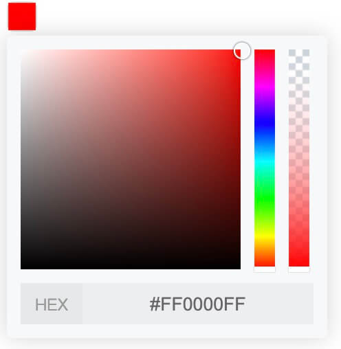

### [vue-pick-colors：颜色拾取器](https://github.com/qiuzongyuan/vue-pick-colors)



安装：

```
npm i vue-pick-colors -S
```

事例：

```vue
<template>
  <pick-colors v-model:value="value" show-alpha/>
</template>

<script lang="ts">
import { defineComponent, ref } from 'vue'
import PickColors from 'vue-pick-colors'
export default defineComponent({
  name: 'App',
  components: {
    PickColors
  },
  setup () {
    const value = ref('#00CED1FF')
    return {
      value
    }
  }
})
</script>
```

API：

| 属性           | 说明               | 类型              | 默认值                                                                                                                                           |
| -------------- | ------------------ |-----------------|-----------------------------------------------------------------------------------------------------------------------------------------------|
| value(v-model) | 值                 | string          | #FF0000FF                                                                                                                                     |
| format         | 格式               | hex / rgb / hsl | hex                                                                                                                                           |
| show-alpha     | 是否支持透明度选择 | boolean         | false                                                                                                                                         |
| theme          | 主题               | light / dark    | light                                                        |
| colors         | 预留颜色           | string []       | ['#ff4500', '#ff8c00', '#ffd700', '#90ee90', '#00ced1', '#1e90ff', '#c71585', '#ff4500ad', '#ff7800ff', '#00babdff', '#1f93ffff', '#c7158577'] |


事件：

| 事件名称 | 说明               | 回调参数               |
| -------- | ------------------ | ---------------------- |
| change   | 颜色变化时回调函数 | Function(color:string) |
