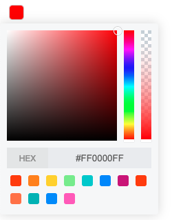

### [vue-pick-colors](https://github.com/qiuzongyuan/vue-pick-colors)

>  🎉 A Color picker for Vue.js 3

> The appearance style is based on [vue-color-kit](https://github.com/anish2690/vue-color-kit)

> [🇨🇳中文版](https://github.com/qiuzongyuan/vue-pick-colors/blob/main/README-zh_CN.md)


### [Online Demo](https://qiuzongyuan.github.io/vue-pick-colors/)

<div style="display: flex">
    
    
</div>

<br/>

### Installation
```
npm install vue-pick-colors
```
or
```
yarn add vue-pick-colors
```
<br/>

### Usage
```vue
<template>
  <pick-colors v-model:value="value" show-alpha/>
</template>

<script lang="ts">
import { defineComponent, ref } from 'vue'
import PickColors from 'vue-pick-colors'
export default defineComponent({
  name: 'App',
  components: {
    PickColors
  },
  setup () {
    const value = ref('#00cedf')
    return {
      value
    }
  }
})
</script>
```
<br/>

### API
| Property             | Description                                                  | Type                          | Default                                                      | version |
| -------------------- | ------------------------------------------------------------ | ----------------------------- | ------------------------------------------------------------ | ------- |
| value(v-model)       | binding value, support hex、rgb、rgba、hsl、hsla、hsv、hsva  | string ｜ string[]            | —                                                            |         |
| show-picker(v-model) | control picker hide or show                                  | boolean                       | —                                                            | 1.5.0   |
| size                 | color block size                                             | number \| string              | 20                                                           |         |
| width                | color block width, if empty use size                         | number \| string              | —                                                            | 1.5.0   |
| height               | color block height, if empty use size                        | number \| string              | —                                                            | 1.5.0   |
| theme                | component theme                                              | light ｜ dark                 | light                                                        |         |
| colors               | predefined color options support hex、rgb、rgba、hsl、hsla、hsva、hsv | string []                     | ['#ff4500','#ff8c00','#ffd700', '#90ee90','#00ced1','#1e90ff', '#c71585','#ff4500','#ff7800', '#00babd','#1f93ff','#fa64c3'] |         |
| format               | color format                                                 | hex ｜ rgb ｜ hsl \| hsv      | hex                                                          |         |
| show-alpha           | whether to display the alpha slider                          | boolean                       | false                                                        |         |
| add-color            | support for adding colors                                    | boolean                       | false                                                        |         |
| popup-container      | defines the container for the picker                         | string \| Vue.RendererElement | 'body'                                                       | 1.5.0   |
| max                  | maximum number of colors to add                              | number                        | 13                                                           |         |

<br/>

### Events

| Events Name  | Description        | Arguments                                                    | version |
| ------------ | ------------------ | ------------------------------------------------------------ | ------- |
| change       | color value change | function(value: string｜string [],color: string,index: number) |         |
| close-picker  | close picker       | function(value: string｜string [])                           | 1.5.0   |
| overflow-max | color added to max | —                                                            |         |